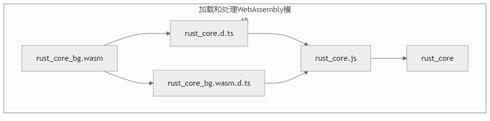
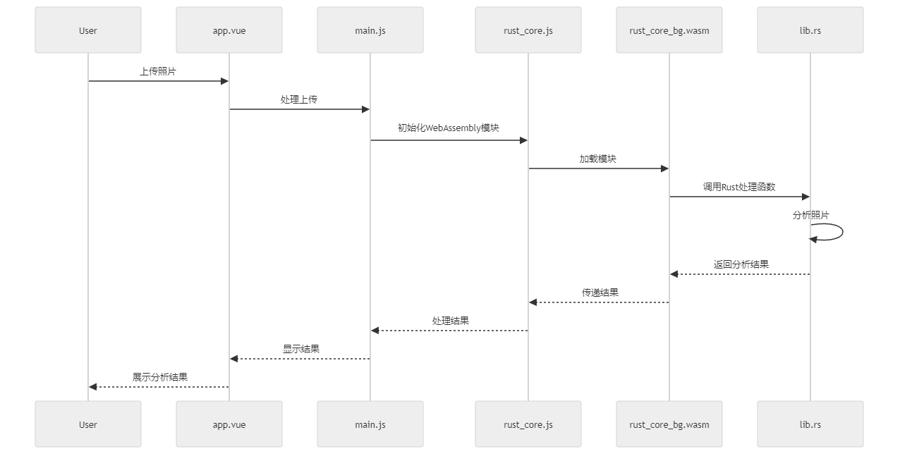
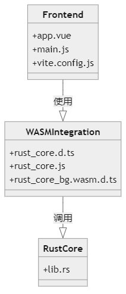
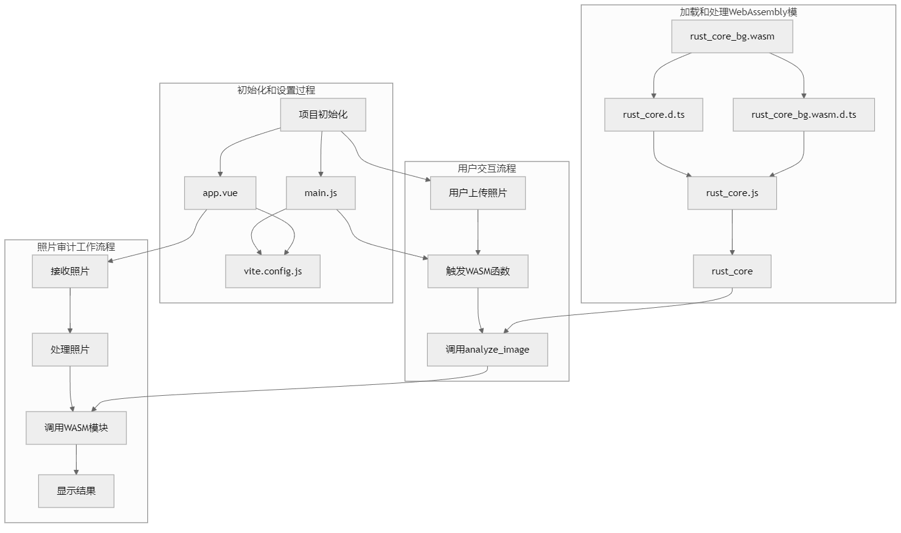

- # 项目名称

## 简介

本项目是一个基于WebAssembly（WASM）的照片审计工具，旨在通过高效的图像处理和分析，为用户提供快速和准确的反馈。项目使用Rust编写核心算法，并通过WASM与前端Vue应用进行交互。

## 功能

- 用户可以通过界面上传照片。
- WASM模块对上传的照片进行处理和分析。
- 处理结果通过前端界面显示给用户。

## 项目结构

### 初始化和设置过程

### 构建流程
# 编译 Rust 为 WASM 模块
- cd rust-core
- wasm-pack build --target web --release --out-dir ../frontend/src/wasm

# 启动前端项目

### 项目启动命令
- cd frontend   
- npm install
- npm run dev

## 系统设计图解

### WASM 模块加载流程

### 系统交互流程

### 系统时序图

### 照片审计工作流程

### 系统类图

### 系统流程图
<<<<<<< HEAD

=======

>>>>>>> 1f5db85 (first commit from local)
